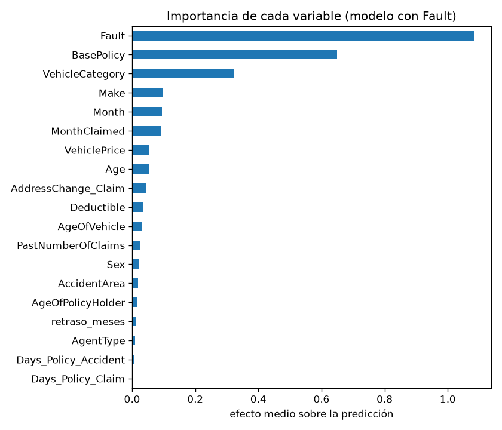

# Detección de fraude en reclamaciones de seguro de coche

Modelo de machine learning que ordena las reclamaciones de una aseguradora por su probabilidad de fraude, para que el equipo de investigación revise primero las más sospechosas.

Revisando solo el 20 % de reclamaciones con mayor puntuación, el modelo encuentra el 60 % del fraude (tres veces más que revisando al azar).

Informe para lectores no técnicos: [reports/informe.md](reports/informe.md).

## Resultados

Evaluación única sobre un 20 % de las reclamaciones apartado desde el principio (test). El fraude es el 6 % de los datos, por lo que la métrica principal es la PR-AUC (el azar da 0,06).

Se entrenaron dos versiones porque el dataset no documenta cuándo se registra la variable Fault (quién tuvo la culpa del accidente), que es la más influyente. Si la culpa solo se conoce después de investigar, hay que usar la versión sin Fault.

| | Con Fault | Sin Fault |
|---|---|---|
| PR-AUC | 0,257 | 0,150 |
| ROC-AUC | 0,833 | 0,748 |
| Fraude encontrado revisando el 5 % | 23 % | 16 % |
| Fraude encontrado revisando el 10 % | 38 % | 29 % |
| Fraude encontrado revisando el 20 % | 60 % | 46 % |
| Fraude encontrado revisando el 30 % | 76 % | 62 % |

Variables que más pesan en el modelo con Fault (SHAP): quién tuvo la culpa, el tipo de cobertura y el tipo de vehículo.



## Enfoque

1. Limpieza y análisis de señal, con cada decisión demostrada en el notebook.
2. Separación train y test antes de cualquier decisión que dependa del fraude, para evitar fugas de información.
3. Validación cruzada estratificada repetida, porque con unos 740 fraudes en train el resultado de una sola partición varía demasiado (desviación de 0,025 en PR-AUC).
4. Ablación de variables para saber qué sostiene el modelo, y comparación de baselines, desbalance (class_weight no ayuda) y cinco modelos.
5. Ajuste de LightGBM con Optuna y evaluación final en test.
6. Interpretabilidad con SHAP, incluidos los fraudes que el modelo no detecta.

Todas las decisiones y sus motivos están en [decisions.md](decisions.md).

## Notebooks

Se ejecutan en este orden; cada uno genera los ficheros que necesita el siguiente.

| Notebook | Contenido | Tiempo aprox. |
|---|---|---|
| 01_eda_limpieza | Limpieza y análisis de señal | 1 min |
| 02_preparacion | Split train/test, selección de variables y preprocesamiento | menos de 1 min |
| 03_modelos_base | Validación, baselines, ablación, desbalance y comparación de modelos | 5 min |
| 04_ajuste_evaluacion | Ajuste con Optuna, umbral, evaluación en test y guardado de los modelos | 8 min |
| 05_interpretabilidad | SHAP, casos concretos y fraudes no detectados | 1 min |

## Cómo reproducirlo

Requiere Python 3.12.

1. Descargar el dataset de [Kaggle](https://www.kaggle.com/datasets/shivamb/vehicle-claim-fraud-detection) y guardar `fraud_oracle.csv` en `data/raw/`.
2. Crear el entorno e instalar las dependencias:

```
python -m venv .venv
.venv\Scripts\activate
pip install -r requirements.txt
```

3. Ejecutar los notebooks de `notebooks/` en orden.

Los datos y los modelos entrenados no se incluyen en el repositorio.

## Usar el modelo entrenado

Tras ejecutar los notebooks 01 a 04, los modelos quedan en `models/`. Cada uno incluye su preprocesamiento:

```python
import joblib
import pandas as pd

modelo = joblib.load('models/modelo_con_fault.joblib')
reclamaciones = pd.read_csv('data/processed/test.csv')

columnas = list(modelo[0].feature_names_in_)
reclamaciones['prob_fraude'] = modelo.predict_proba(reclamaciones[columnas])[:, 1]
reclamaciones.nlargest(10, 'prob_fraude')
```

## Limitaciones

- Fault sostiene cerca del 40 % del rendimiento y no se sabe cuándo se registra en la práctica.
- Los datos son de 1994 a 1996 y de una sola fuente pública; habría que reentrenar y validar con datos actuales.
- El modelo casi nunca detecta fraudes en pólizas de solo daños a terceros, donde el fraude es muy raro (0,5 %).
- En unas 5.000 pólizas, dos campos se contradicen sobre si el vehículo es turismo o deportivo.
- El dataset no incluye importes, así que los costes de investigar y de no detectar un fraude son supuestos, no datos.

## Estructura

```
data/            datos (no versionados)
models/          modelos entrenados (no versionados)
notebooks/       análisis y modelado, del 01 al 05
reports/         informe no técnico y figuras
src/             preprocesamiento reutilizable
decisions.md     registro de decisiones
```

## Licencia

MIT, ver [LICENSE](LICENSE).
